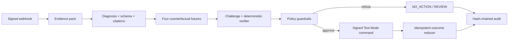

# RECOURSE

**Adversarial counterfactual revenue recovery for Razorpay Test Mode.**

Payment recovery systems usually ask, “Which intervention converts?” RECOURSE asks the harder question: **“What value did the intervention add beyond recovery that would have happened anyway—and is the action defensible?”**

A signed `payment.failed` event becomes a canonical case and evidence pack. A bounded model diagnoses the failure, four calibrated futures include `NO_ACTION`, a challenger searches for objections, deterministic code verifies every cited fact, and policy either refuses or emits one signed Test Mode command. Every transition is hash-audited.

> Razorpay is used only in Test Mode. Judge cases and evaluation data are synthetic. Reported results are not production uplift claims.

## 60-second quick start

Prerequisites: Python 3.11+ and Node.js 20+.

```powershell
python -m venv .venv
.venv\Scripts\Activate.ps1
python -m pip install -e ".[dev]"
npm ci --prefix apps/web
Copy-Item .env.example .env
$env:PYTHONPATH="apps/api/src"
python -m alembic -c apps/api/alembic.ini upgrade head
```

Start the API and web app in separate terminals:

```powershell
$env:PYTHONPATH="apps/api/src"
python -m uvicorn recourse.main:app --reload
```

```powershell
npm run dev --prefix apps/web
```

Open `http://localhost:5173`, choose **Reset judge demo**, and follow the prioritized queue. No provider credentials are required for the complete signed-fixture journey.

## Judge journey

1. **Recovery Inbox** — prioritized failed amount, conservative recoverable value, source and state labels.
2. **Hero Workbench** — cited evidence, four futures, natural-recovery baseline, uncertainty, costs, challenger, verifier, policy and audit.
3. **Low-value refusal** — conservative value fails the threshold and ends in `NO_ACTION`.
4. **Decision Surgery** — mutate a cloned input, observe the decision flip and new hash; external adapters remain hard-disabled.
5. **Evaluation Lab** — generated metrics for rules, single model, full RECOURSE and evaluator-only oracle across 60 frozen cases.

The reset seeds four signed cases: hero recovery, low value, opt-out, and uncertain evidence (`HUMAN_REVIEW`).

## Architecture



The OpenRouter boundary never selects or executes an action. The Razorpay adapter accepts only `rzp_test_` keys, disables notifications/reminders, preserves original amount/currency, and creates at most one link per case. Duplicate and reversed outcomes cannot regress `RECOVERED`.

Read the full [architecture and trust boundaries](docs/architecture.md).

## Generated final results

Full RECOURSE on the frozen synthetic benchmark currently reports:

| Metric | Generated result |
|---|---:|
| Cases | 60 |
| Realized incremental net value | ₹63,472.72 |
| Guardrail violations | 0 / 60 |
| Review rate | 8.33% |
| Macro Brier score | 0.1926 |
| Mean regret | ₹1,195.25 |

The evaluator writes aggregate JSON/Markdown, per-case JSONL/CSV, freeze hashes, reliability bins, confusion counts, regret, latency, ablations, denominators, and an honest losing-case analysis under `evals/results/final-*`.

## Verification

```powershell
$env:PYTHONPATH="apps/api/src"
python -m pytest
python scripts/smoke.py --reset --fixture-flow --verify-audit --verify-eval
python scripts/harden.py
npm test --prefix apps/web
npm run test:e2e --prefix apps/web
npm run build --prefix apps/web
```

The browser suite covers hero recovery exactly once, low-value refusal, opt-out guardrail, uncertain review, Decision Surgery, Evaluation Lab metadata, responsive layout, and screenshots of all four routes.

## Provider configuration

Copy `.env.example` to `.env`. Keep real values only in `.env`, which is ignored.

- OpenRouter: set `OPENROUTER_API_KEY`; the live-validated pinned slug is `liquid/lfm-2.5-2.6b:free`.
- Razorpay: set `RAZORPAY_ENABLED=true`, an `rzp_test_` key ID, key secret, and a webhook secret distinct from `FIXTURE_WEBHOOK_SECRET`.
- Never expose secrets through `VITE_*` variables. Only a Test Mode key ID may reach Checkout.

Provider timeout, rate limit, missing credits, bad JSON and unsupported evidence fall back safely. Ambiguous Payment Link creation enters reconciliation by stable reference rather than blindly creating another link.

## Reproducibility and documentation

- [Architecture](docs/architecture.md)
- [Model card](docs/model_card.md)
- [Data card](data/data_card.md)
- [Final evaluation](evals/results/final-evaluation.md)
- [Security and hardening](docs/security.md)
- [Live provider validation](docs/live_validation.md)
- [Five-minute demo script](docs/demo_script.md)
- [Submission checklist](docs/submission_checklist.md)
- [Buildathon blueprint](RECOURSE_BUILDATHON_BLUEPRINT.md)

Regenerate the statistical layer with `python scripts/generate_data.py`, `python scripts/train.py`, and `python scripts/evaluate.py`. Training code cannot import frozen potential outcomes, and every model artifact is verified by hash on load.

## Public demo deployment

The repository contains a safe split deployment configuration:

- `render.yaml` runs the FastAPI backend on Render with generated signing secrets, temporary SQLite storage, and all paid/external providers disabled.
- `apps/web/vercel.json` builds the Vite frontend on Vercel and proxies `/api` and `/health` to the Render service.

On Vercel, select `apps/web` as the project root. The public deployment is intentionally deterministic: visitors cannot consume OpenRouter credits or create Razorpay links. Use **Reset judge demo** whenever the temporary Render database is recreated after a deployment or restart.

## Limitations

- Synthetic data cannot establish real-world uplift, fairness, or calibration.
- This MVP is single-merchant, local-first, INR-oriented, and Test Mode only.
- It does not automatically charge stored methods, send messages, offer discounts, or support live keys.
- Provider-delivered webhooks require a reachable callback configured in the Razorpay dashboard; signed offline replay remains the reliable demo fallback.
- Policy thresholds and model calibration require production revalidation before real use.

## License

[MIT](LICENSE)
