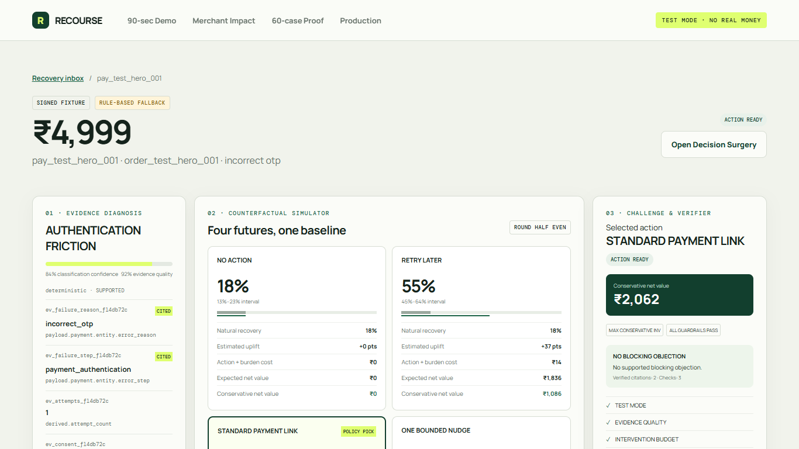
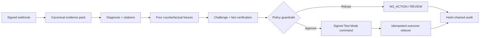

<div align="center">

# RECOURSE

### Evidence-first revenue recovery for failed payments

RECOURSE turns a signed `payment.failed` event into a verified, policy-safe recovery decision—then executes at most one signed action in Razorpay Test Mode.

[](https://www.python.org/)
[](https://fastapi.tiangolo.com/)
[](https://react.dev/)
[](https://www.typescriptlang.org/)
[](LICENSE)
[](https://razorpay.com/)

[Live Demo](https://recourse-razorpay-recovery.vercel.app) · [Architecture](docs/architecture.md) · [Evaluation](evals/results/final-evaluation.md) · [Demo Script](docs/demo_script.md)

</div>



> [!IMPORTANT]
> RECOURSE uses Razorpay **Test Mode only**. Judge cases and evaluation data are synthetic, and the reported results are not claims of production uplift.

## Why RECOURSE?

Most recovery systems ask, “Which intervention is most likely to convert?” RECOURSE asks a stricter question:

> **What incremental value did the intervention add beyond recovery that would have happened anyway—and can every action be defended?**

A bounded agent diagnoses the failure, estimates four counterfactual futures (including `NO_ACTION`), and challenges its own recommendation. Deterministic code then verifies every cited fact and applies consent, value, budget, and Test Mode guardrails before a signed command can be emitted. Every transition is recorded in a hash-chained audit trail.

## Highlights

| Capability | What it provides |
|---|---|
| Evidence-grounded diagnosis | Structured diagnoses with citations resolved against the decision-time evidence pack |
| Counterfactual value estimation | Four calibrated futures compared with the natural-recovery baseline |
| Adversarial review | A challenger searches for unsupported assumptions and reasons to abstain |
| Deterministic safety layer | Consent, contact limits, budgets, value thresholds, and Test Mode are enforced in code |
| Safe execution | Signed commands, idempotency, stable references, and at most one payment link per case |
| Verifiable auditability | Append-only, hash-chained events make every decision reproducible and inspectable |
| Honest evaluation | Frozen synthetic benchmark, baselines, calibration, regret, ablations, and losing-case analysis |

## How it works



The model can analyze evidence, but it cannot select or execute an action directly. The Razorpay adapter accepts only `rzp_test_` keys, disables notifications and reminders, preserves the original amount and currency, and reconciles ambiguous provider responses instead of blindly retrying.

For trust boundaries and persistence details, see the [architecture document](docs/architecture.md).

## Quick start

### Prerequisites

- Python 3.11 or newer
- Node.js 20 or newer
- Git

### 1. Install

```powershell
git clone https://github.com/ronie0012/razorpay_hackathon_Recourse.git
cd razorpay_hackathon_Recourse

python -m venv .venv
.venv\Scripts\Activate.ps1
python -m pip install -e ".[dev]"
npm ci --prefix apps/web

Copy-Item .env.example .env
$env:PYTHONPATH="apps/api/src"
python -m alembic -c apps/api/alembic.ini upgrade head
```

### 2. Run

Start the API:

```powershell
$env:PYTHONPATH="apps/api/src"
python -m uvicorn recourse.main:app --reload
```

In a second terminal, start the web app:

```powershell
npm run dev --prefix apps/web
```

Open [http://localhost:5173](http://localhost:5173) and select **Start end-to-end demo**.

The guided journey requires no provider credentials: it creates a fresh signed failure, runs the decision pipeline, explains the proposed recovery action, and reconciles a signed paid outcome. With Razorpay Test Mode and a public webhook configured, the same screen can launch hosted Checkout and wait for provider-delivered evidence.

## Product tour

1. **Live Recovery Demo** — trigger a failed payment and follow the verified agent trace through recovery.
2. **Recovery Inbox** — prioritize cases by failed amount, conservative recoverable value, source, and state.
3. **Hero Workbench** — inspect evidence, counterfactuals, uncertainty, costs, challenge, verification, policy, and audit history.
4. **Low-value refusal** — see the system choose `NO_ACTION` when conservative value misses the threshold.
5. **Decision Surgery** — clone and mutate an input, then observe the decision and audit hash change safely.
6. **Evaluation Lab** — compare rules, a single model, full RECOURSE, and an evaluator-only oracle across 60 frozen cases.

Resetting the demo seeds four representative cases: hero recovery, low value, customer opt-out, and uncertain evidence requiring `HUMAN_REVIEW`.

## Evaluation snapshot

Results from the frozen synthetic benchmark:

| Metric | Full RECOURSE |
|---|---:|
| Evaluated cases | 60 |
| Realized incremental net value | ₹63,472.72 |
| Guardrail violations | 0 / 60 |
| Review rate | 8.33% |
| Macro Brier score | 0.1926 |
| Mean regret | ₹1,195.25 |

The evaluator writes aggregate JSON and Markdown reports, per-case JSONL and CSV, freeze hashes, reliability bins, confusion counts, regret, latency, ablations, denominators, and an explicit losing-case analysis under [`evals/results`](evals/results).

Read the complete [final evaluation](evals/results/final-evaluation.md) and [model card](docs/model_card.md).

## Technology

| Layer | Technologies |
|---|---|
| Web | React 19, TypeScript, Vite, TanStack Query, React Router |
| API | FastAPI, SQLAlchemy, Alembic, Pydantic |
| Modeling | scikit-learn, NumPy, joblib |
| Agent boundary | OpenRouter with schema-constrained outputs and deterministic fallbacks |
| Payments | Razorpay Test Mode with HMAC verification and idempotent reconciliation |
| Persistence | SQLite locally; PostgreSQL in the hosted deployment |
| Quality | pytest, Hypothesis, Vitest, Playwright, smoke and hardening scripts |

## Repository structure

```text
.
├── apps/
│   ├── api/                 # FastAPI service, domain logic, agents, and tests
│   └── web/                 # React application and Playwright journeys
├── data/                    # Signed fixtures, frozen datasets, and data card
├── docs/                    # Architecture, security, validation, and demo guides
├── evals/                   # Baselines, metrics, and generated evaluation artifacts
├── models/artifacts/        # Hash-verified trained model artifacts
├── prompts/                 # Versioned prompts and JSON schemas
└── scripts/                 # Data, training, evaluation, smoke, and hardening tools
```

## Configuration

Copy `.env.example` to `.env`; the local file is ignored by Git.

| Integration | Configuration |
|---|---|
| OpenRouter | Set `OPENROUTER_API_KEY`. The pinned model slug is `liquid/lfm-2.5-2.6b:free`. |
| Razorpay | Set `RAZORPAY_ENABLED=true`, an `rzp_test_` key ID, key secret, and a webhook secret different from `FIXTURE_WEBHOOK_SECRET`. |

Never expose secrets through `VITE_*` variables. Only a Razorpay Test Mode key ID may reach Checkout. Provider timeouts, rate limits, missing credits, malformed JSON, and unsupported evidence fall back safely.

## Verification

Run the complete verification suite from the repository root:

```powershell
$env:PYTHONPATH="apps/api/src"
python -m pytest
python scripts/smoke.py --reset --fixture-flow --verify-audit --verify-eval
python scripts/harden.py
npm test --prefix apps/web
npm run test:e2e --prefix apps/web
npm run build --prefix apps/web
```

The browser suite covers hero recovery exactly once, low-value refusal, opt-out enforcement, uncertain review, Decision Surgery, Evaluation Lab metadata, responsive layouts, and screenshots of all primary routes.

To regenerate the statistical layer:

```powershell
python scripts/generate_data.py
python scripts/train.py
python scripts/evaluate.py
```

Training code cannot import frozen potential outcomes, and every model artifact is verified by hash when loaded.

## Deployment

- **Frontend:** [recourse-razorpay-recovery.vercel.app](https://recourse-razorpay-recovery.vercel.app)
- **API readiness:** [recourse-razorpay-recovery-api.onrender.com/health/ready](https://recourse-razorpay-recovery-api.onrender.com/health/ready)

`render.yaml` provisions the FastAPI service and PostgreSQL on Render. `apps/web/vercel.json` builds the Vite frontend on Vercel and proxies `/api` and `/health` to the backend. Provider credentials remain dashboard-managed and are never committed to Git.

The public deployment is intentionally deterministic: visitors cannot consume OpenRouter credits or create Razorpay links. Render free PostgreSQL databases expire after 30 days, so the datastore must be renewed or upgraded for a longer-lived deployment.

## Documentation

- [Architecture and trust boundaries](docs/architecture.md)
- [Security and hardening](docs/security.md)
- [Model card](docs/model_card.md)
- [Data card](data/data_card.md)
- [Final evaluation](evals/results/final-evaluation.md)
- [Live provider validation](docs/live_validation.md)
- [Five-minute demo script](docs/demo_script.md)
- [Submission checklist](docs/submission_checklist.md)
- [Buildathon blueprint](RECOURSE_BUILDATHON_BLUEPRINT.md)

## Limitations

- Synthetic data cannot establish real-world uplift, fairness, or calibration.
- The MVP is single-merchant, local-first, INR-oriented, and Test Mode only.
- It does not automatically charge stored methods, message customers, offer discounts, or accept live keys.
- Provider webhooks require a reachable callback configured in Razorpay; signed offline replay remains the reliable demo fallback.
- Policy thresholds and model calibration require production revalidation before real-world use.

## License

Released under the [MIT License](LICENSE).
