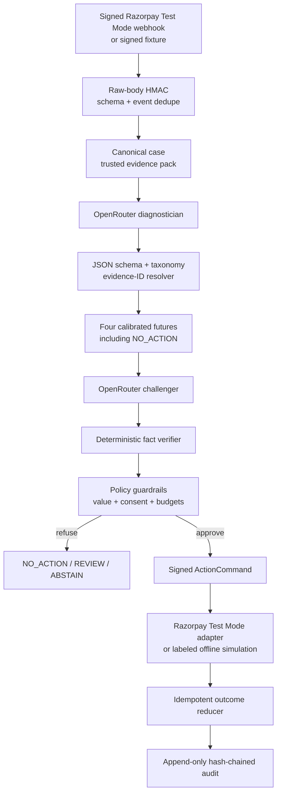

# RECOURSE architecture

RECOURSE separates probabilistic evidence work from deterministic payment execution. No model output or browser request can directly invoke Razorpay.

## Trust boundaries

| Boundary | Untrusted input | Enforcement |
|---|---|---|
| Webhook gateway | HTTP body and headers | Constant-time HMAC before JSON parsing, strict event schema, unique event ID |
| Evidence agent | Webhook text and model JSON | Minimized fields, fixed schema, taxonomy enum, decision-time evidence resolver |
| Policy | Predictions and challenge | Integer-subunit value math, lower-bound selection, consent/contact/attempt/Test Mode gates |
| Execution | Browser and provider state | Typed command, policy signature, `rzp_test_` enforcement, one execution per case |
| Outcome | Duplicates and reversed events | Stable reference ownership, amount/currency match, monotone terminal precedence |

## Persistence

SQLite stores normalized cases, evidence, estimates, diagnoses, challenges, decisions, executions, raw events, and append-only audit events. Unique constraints enforce event, command, decision, reference, and one-action-per-case idempotency.

## Offline equivalence

Signed fixtures enter through a separate secret and route but converge on the same canonical case, policy, command, state machine, and audit code. Every surface labels fixture replay and Test Mode explicitly.
